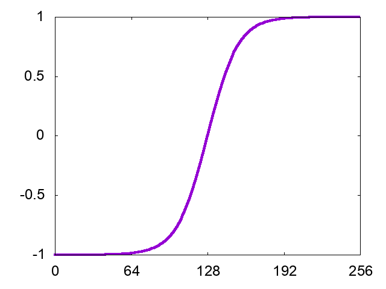

[Jananese](README_ja.md)/ English

# Example of Multiresolution Analysis using Haar Wavelet

## Usage

    $ make

## Results

* input Data

* Transformed Data

* Inverse Transformed data using only 10% of wavelets

