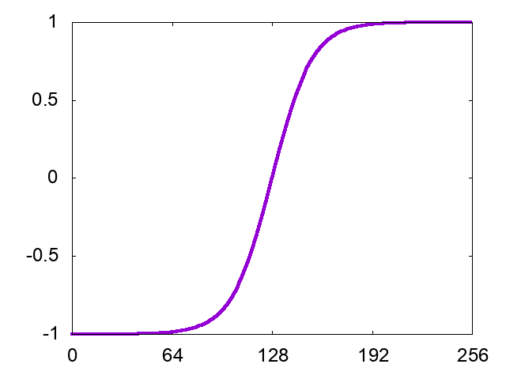
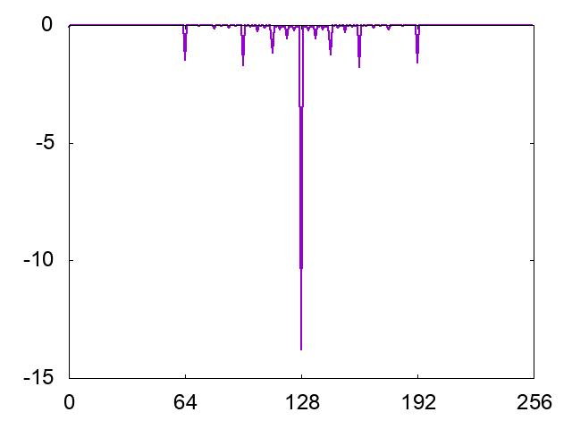
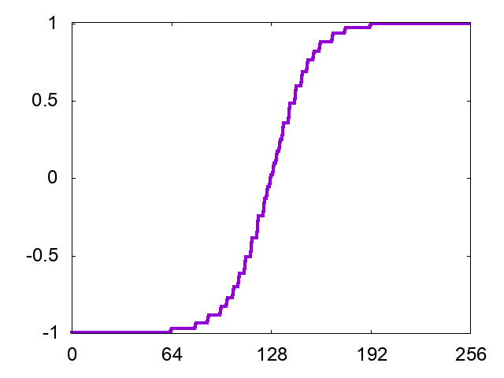

Japanese/ [English](README.md)

# ハールウェーブレットを用いた多重解像度解析のサンプル

## 概要

ハールウェーブレット(Haar Wavelet)を使って多重解像度解析をしてみる。
詳細な解説は[Qiita](http://qiita.com/kaityo256/items/70dc20658ef98d229de9)に書いたのでそちらを参照。

## 使い方

    $ make

## 結果

* input Data

* Transformed Data

* Inverse Transformed data using only 10% of wavelets

